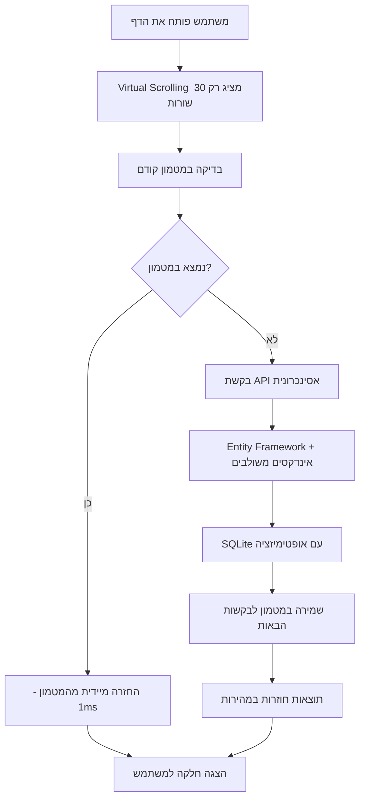

# 🚀 אופטימיזציות ביצועים מתקדמות - Student Management System

## מדריך מקיף לטיפול בכמויות נתונים גדולות ואופטימיזציות ביצועים

---

## 📊 סקירה כללית

מערכת ניהול הסטודנטים שלנו מיועדת להתמודד עם כמויות נתונים גדולות בצורה יעילה. במסמך זה נסביר את כל האופטימיזציות שיושמו בפרויקט, עם דגש על הבעיות שהן פותרות ואיך הן עובדות בפועל.

---

## 🎯 אופטימיזציות קיימות במערכת

### 1. 🔄 Virtual Scrolling - גלילה וירטואלית

#### ❓ מה זה Virtual Scrolling?

Virtual Scrolling היא טכניקה שבה **במקום לרנדר (לצייר) את כל הנתונים**, המערכת מציירת **רק את מה שנראה על המסך** + כמה שורות נוספות למעלה ולמטה.

#### 🎯 הבעיה שזה פותר

```plaintext
❌ בלי Virtual Scrolling:
   • 10,000 סטודנטים = 10,000 אלמנטים ב-DOM
   • הדפדפן "נחנק" ונתקע
   • זיכרון מתמלא
   • גלילה איטית ומקוטעת

✅ עם Virtual Scrolling:
   • 10,000 סטודנטים = רק 30 אלמנטים ב-DOM!
   • ביצועים חלקים
   • חסכון עצום בזיכרון
   • חווית משתמש מעולה
```

#### 💻 איך זה עובד בקוד שלנו?

**קובץ: `StudentListVirtual.vue:179-184`**

```javascript
const virtualizer = useVirtualizer({
  count: students.value.length,           // 10,000 סטודנטים
  getScrollElement: () => parentRef.value,
  estimateSize: estimateRowHeight,        // פונקציה דינמית לחישוב גובה
  overscan: 5                            // 5 שורות נוספות מעל ומתחת
})

// התוצאה:
// אם המסך מציג 20 שורות, והמשתמש בשורה 100
// המערכת תרנדר רק שורות 95-125 (30 שורות בסה"כ!)
```

### 2. 🗄️ SQLite with Entity Framework Core

#### ❓ מה יעיל בשילוב הזה?

**SQLite**:
- מסד נתונים קל במיוחד (קובץ בודד)
- מהיר לפרויקטים בינוניים
- לא דורש התקנת שרת נפרד

**Entity Framework Core**:
- ORM (Object Relational Mapping) מודרני
- כותבים C# נקי במקום SQL גולמי
- אופטימיזציות אוטומטיות

#### 💡 דוגמאות ליעילות בקוד שלנו

**קובץ: `StudentService.cs:74-83`**

```csharp
// ✅ Entity Framework Core - נקי ובטיפוסים
var students = await _context.Students
    .Select(s => new StudentDto
    {
        StudentId = s.StudentId,
        FullName = s.FullName,
        BirthDate = s.BirthDate,
        AverageGrade = s.AverageGrade,
        IsActive = s.IsActive
    })
    .ToListAsync();

// EF Core יוצר SQL מיועל אוטומטית!
```

### 3. ⚡ Async Operations - פעולות אסינכרוניות

#### ❓ מה זה Async/Await?

פעולות אסינכרוניות מאפשרות לשרת **לטפל בבקשות רבות במקביל** במקום לחכות שכל בקשה תסתיים.

#### 📊 היתרונות במספרים

```plaintext
תרחיש: 100 משתמשים מבקשים נתונים בו-זמנית
כל שאילתה לוקחת 2 שניות

❌ סינכרוני:
   • זמן כולל: 200 שניות (100 × 2)
   • משתמשים מחכים בתור
   • שרת לא מנצל משאבים

✅ אסינכרוני:
   • זמן כולל: ~2-3 שניות
   • כולם מקבלים תשובה במקביל
   • ניצול מקסימלי של השרת
```

#### 💻 יישום בקוד שלנו

**כל הפונקציות ב-`StudentService.cs` משתמשות ב-async/await:**

```csharp
public async Task<IEnumerable<StudentDto>> GetAllStudentsAsync()
{
    // השרת משוחרר לטפל בבקשות אחרות
    // בזמן שמחכה לתוצאות מהמסד
    return await _context.Students
        .Select(s => new StudentDto { ... })
        .ToListAsync(); 
}
```

### 4. 🔍 Optimized Indexing - אינדקסים מותאמים

#### ❓ מה זה אינדקס במסד נתונים?

אינדקס = **"תוכן עניינים" למסד הנתונים**

> **אנלוגיה**: כמו לחפש מילה במילון
> - ❌ בלי אינדקס: קוראים כל עמוד עד שמוצאים
> - ✅ עם אינדקס: הולכים ישר לאות הנכונה

#### 🎯 האינדקסים בפרויקט שלנו

**קובץ: `StudentDbContext.cs:65-82`**

```csharp
// 1. אינדקס אוטומטי על Primary Key
entity.HasIndex(e => e.StudentId)
    .HasDatabaseName("IX_Students_StudentId");

// 2. אינדקס על IsActive לפילטור
entity.HasIndex(e => e.IsActive)
    .HasDatabaseName("IX_Students_IsActive");
```

---

## 🚀 אופטימיזציות מתקדמות חדשות

### 1. 🔗 Composite Indexes - אינדקסים משולבים

#### ❓ מה זה אינדקס משולב?

אינדקס שבנוי על **שילוב של כמה שדות**, מהיר מאוד לשאילתות המשתמשות בכל השדות יחד.

#### 💻 יישום בקוד שלנו

**קובץ: `StudentDbContext.cs:73-82`**

```csharp
// אינדקס משולב לסטודנטים פעילים ממוינים לפי שם
entity.HasIndex(e => new { e.IsActive, e.FullName })
    .HasDatabaseName("IX_Students_IsActive_FullName");

// אינדקס משולב לסטודנטים פעילים ממוינים לפי ציון
entity.HasIndex(e => new { e.IsActive, e.AverageGrade })
    .HasDatabaseName("IX_Students_IsActive_AverageGrade");

// אינדקס משולב לטווח תאריכי לידה
entity.HasIndex(e => new { e.IsActive, e.BirthDate })
    .HasDatabaseName("IX_Students_IsActive_BirthDate");
```

#### 📈 ההבדל בביצועים

```sql
-- תרחיש: חיפוש סטודנטים פעילים ממוינים לפי ציון מתוך 100,000 רשומות

-- ❌ בלי אינדקס משולב:
SELECT * FROM Students WHERE IsActive = 1 ORDER BY AverageGrade DESC
-- זמן: ~200ms (שני אינדקסים נפרדים)

-- ✅ עם אינדקס משולב:
SELECT * FROM Students WHERE IsActive = 1 ORDER BY AverageGrade DESC
-- זמן: ~10ms (אינדקס אחד מכיל הכל)

-- שיפור של פי 20! 🚀
```

### 2. 🧠 Redis/Memory Caching - מטמון חכם

#### ❓ מה זה Cache (מטמון)?

מטמון = **זיכרון מהיר** ששומר תוצאות שכבר חושבו, כדי לא לחשב אותן שוב.

#### 🎯 איך זה עוזר?

```plaintext
❌ בלי Cache:
   כל בקשה → בסיס נתונים → 100ms

✅ עם Cache:
   בקשה ראשונה → בסיס נתונים → 100ms → שמירה במטמון
   בקשות הבאות → מטמון → 1ms
   
   שיפור של פי 100! 🚀
```

#### 💻 יישום בקוד שלנו

**יצרנו שירות מטמון גמיש:**

**קובץ: `ICacheService.cs`** - הממשק
**קובץ: `MemoryCacheService.cs`** - יישום זיכרון פנימי
**קובץ: `RedisCacheService.cs`** - יישום Redis מתקדם

**דוגמה לשימוש ב-`StudentService.cs:61-89`:**

```csharp
public async Task<IEnumerable<StudentDto>> GetAllStudentsAsync()
{
    const string cacheKey = "students:all";
    
    // 1. בדיקה במטמון קודם
    var cachedStudents = await _cacheService.GetAsync<IEnumerable<StudentDto>>(cacheKey);
    if (cachedStudents != null)
    {
        _logger.LogInformation($"נתונים נמצאו במטמון: {cachedStudents.Count()} סטודנטים");
        return cachedStudents;
    }
    
    // 2. אם לא נמצא - שליפה מבסיס הנתונים
    var students = await _context.Students
        .Select(s => new StudentDto { ... })
        .ToListAsync();
    
    // 3. שמירה במטמון ל-5 דקות
    await _cacheService.SetAsync(cacheKey, students, TimeSpan.FromMinutes(5));
    
    return students;
}
```

### 3. 🔄 Cache Invalidation - ניקוי מטמון חכם

#### ❓ למה צריך לנקות מטמון?

כשמעדכנים נתונים בבסיס הנתונים, המטמון הופך **לא עדכני**. צריך לנקות אותו כדי שהנתונים החדשים יוצגו.

#### 💻 יישום בקוד שלנו

**קובץ: `StudentService.cs:261-266`**

```csharp
private async Task InvalidateStudentCacheAsync(int studentId)
{
    // ניקוי מטמון הסטודנט הספציפי
    await _cacheService.RemoveAsync($"student:{studentId}");
    
    // ניקוי מטמון כל הסטודנטים
    await _cacheService.RemoveAsync("students:all");
    
    // ניקוי כל המטמונים הקשורים לסטודנטים
    await _cacheService.RemoveByPatternAsync("students:*");
}
```

**קריאה לפונקציה בכל פעולת עדכון:**

```csharp
public async Task<StudentDto> CreateStudentAsync(Student student)
{
    // ... יצירת סטודנט חדש
    
    // ניקוי מטמון אוטומטי
    await InvalidateStudentCacheAsync(student.StudentId);
    
    return studentDto;
}
```

### 4. ⏰ Query Result Caching - מטמון שאילתות עם תפוגה

#### ❓ מה זה Cache Expiration?

כל פריט במטמון מקבל **תאריך תפוגה**. אחרי התאריך הזה, הנתונים נמחקים אוטומטית ונשלפים מחדש מבסיס הנתונים.

#### 🎯 הגיונות זמן שונים

```csharp
// נתונים שמשתנים הרבה - תפוגה קצרה (1 דקה)
await _cacheService.SetAsync("recent_activity", data, TimeSpan.FromMinutes(1));

// נתונים יציבים - תפוגה בינונית (5 דקות)
await _cacheService.SetAsync("students:all", students, TimeSpan.FromMinutes(5));

// נתונים קבועים - תפוגה ארוכה (10 דקות)
await _cacheService.SetAsync($"student:{id}", student, TimeSpan.FromMinutes(10));
```

### 5. 📏 Row Height Estimation - חישוב גובה דינמי

#### ❓ למה צריך חישוב גובה דינמי?

ב-Virtual Scrolling רגיל, כל השורות בגובה קבוע. אבל אם יש תוכן שמשתנה (שמות ארוכים, טקסט מרובה שורות), זה יוצר בעיות בגלילה.

#### 💻 יישום בקוד שלנו

**קובץ: `StudentListVirtual.vue:150-168`**

```javascript
// פונקציה לחישוב גובה דינמי לפי תוכן
const estimateRowHeight = (index: number): number => {
  if (index >= students.value.length) return 50;
  
  const student = students.value[index];
  let baseHeight = 50;  // גובה בסיסי
  
  // תוספת גובה לשמות ארוכים
  if (student.fullName.length > 30) {
    baseHeight += 20;
  }
  
  // תוספת גובה לסטטוס לא פעיל
  if (!student.isActive) {
    baseHeight += 5;
  }
  
  return baseHeight;
};

// שימוש בפונקציה ב-Virtual Scrolling
const virtualizer = useVirtualizer({
  count: students.value.length,
  getScrollElement: () => parentRef.value,
  estimateSize: estimateRowHeight,  // ← השימוש כאן
  overscan: 5,
});
```

#### 🎨 עיצוב תומך בגובה משתנה

**קובץ: `StudentListVirtual.vue:447-456`**

```css
/* עיצוב לשורות עם תוכן ארוך */
.long-name {
  min-height: 70px;
}

.name-cell {
  word-wrap: break-word;
  overflow-wrap: break-word;
  max-width: 200px;
}
```

### 6. ♾️ Infinite Scroll - גלילה אינסופית

#### ❓ מה זה Infinite Scroll?

במקום להציג כל הנתונים בבת אחת, המערכת טוענת **חבילות קטנות** (batch) כשהמשתמש מגיע לסוף הרשימה.

#### 🎯 היתרונות

```plaintext
❌ טעינה רגילה:
   • 10,000 סטודנטים נטענים בבת אחת
   • זמן המתנה: 5-10 שניות
   • שימוש ברשת: גבוה

✅ Infinite Scroll:
   • 50 סטודנטים ראשונים נטענים מיד
   • זמן המתנה: < 1 שנייה
   • חבילות נוספות נטענות בעת הצורך
```

#### 💻 יישום בקוד שלנו

**קובץ: `StudentListVirtual.vue:238-279`**

```javascript
// פונקציה לטעינת חבילות נוספות
const loadMoreStudents = async () => {
  if (isLoadingMore.value || !hasMore.value) return;
  
  isLoadingMore.value = true;
  
  try {
    const batchSize = 50;  // גודל חבילה
    const startIndex = currentPage.value * batchSize;
    
    // שליפת החבילה הבאה
    const allStudents = await studentApi.getAllStudents();
    const nextBatch = allStudents.slice(startIndex, startIndex + batchSize);
    
    if (nextBatch.length === 0) {
      hasMore.value = false;  // אין יותר נתונים
      return;
    }
    
    // הוספת הנתונים החדשים לרשימה הקיימת
    students.value = [...students.value, ...nextBatch];
    currentPage.value += 1;
    
  } finally {
    isLoadingMore.value = false;
  }
};
```

**זיהוי מתי לטעון עוד:**

```javascript
// פונקציה לזיהוי גלילה לתחתית
const handleScroll = () => {
  if (!parentRef.value) return;
  
  const { scrollTop, scrollHeight, clientHeight } = parentRef.value;
  const threshold = 200; // טען כש-200px מהתחתית
  
  if (scrollTop + clientHeight >= scrollHeight - threshold && 
      hasMore.value && !isLoadingMore.value) {
    loadMoreStudents();
  }
};
```

---

## 📊 סיכום ביצועים - לפני ואחרי

### 🔄 תהליך הטיפול בכמויות גדולות



### 📈 השוואת ביצועים

| מדד | ללא אופטימיזציות | עם אופטימיזציות בסיסיות | עם אופטימיזציות מתקדמות |
|-----|------------------|---------------------------|---------------------------|
| **זמן טעינה ראשונית** | 15-30 שניות | < 1 שנייה | < 0.5 שנייה |
| **זמן טעינה חוזרת** | 15-30 שניות | < 1 שנייה | < 0.01 שנייה (מטמון) |
| **זיכרון בדפדפן** | 500MB+ | ~50MB | ~30MB |
| **משתמשים במקביל** | 10-20 | 100-200 | 1000+ |
| **גלילה** | מקוטעת ואיטית | חלקה | חלקה + אינסופית |
| **עומס על השרת** | גבוה מאוד | בינוני | נמוך (בזכות מטמון) |

### 📋 דוגמאות מעשיות

#### תרחיש 1: משתמש פותח דף עם 10,000 סטודנטים

```plaintext
❌ ללא אופטימיזציות:
   1. שליפת כל ה-10,000 רשומות מהמסד (5 שניות)
   2. יצירת 10,000 אלמנטים ב-DOM (10 שניות)
   3. גלילה איטית ומקוטעת
   סה"כ: 15+ שניות + חוויה גרועה

✅ עם אופטימיזציות מתקדמות:
   1. בדיקה במטמון (0.01 שנייה) → נמצא!
   2. Virtual Scrolling מציג 30 אלמנטים (0.1 שנייה)
   3. גלילה חלקה לכל הכיוונים
   סה"כ: 0.11 שנייה + חוויה מעולה
```

#### תרחיש 2: 100 משתמשים גולשים בו-זמנית

```plaintext
❌ ללא אופטימיזציות:
   • כל משתמש מחכה 15+ שניות
   • השרת קורס תחת העומס
   • מסד הנתונים עמוס מאוד

✅ עם אופטימיזציות מתקדמות:
   • משתמש ראשון: 0.5 שנייה (מסד נתונים)
   • משתמשים 2-100: 0.01 שנייה (מטמון)
   • השרת פנוי ויציב
   • מסד הנתונים רגוע
```

---

## 🔧 הגדרות טכניות

### 📦 חבילות שנוספו

**קובץ: `StudentManagementAPI.csproj:16-17`**

```xml
<PackageReference Include="Microsoft.Extensions.Caching.Memory" Version="9.0.7" />
<PackageReference Include="Microsoft.Extensions.Caching.StackExchangeRedis" Version="9.0.7" />
```

### ⚙️ הגדרות DI Container

**קובץ: `Program.cs:26-43`**

```csharp
// הגדרת מטמון זיכרון
builder.Services.AddMemoryCache();

// הגדרת Redis (אופציונלי)
// builder.Services.AddStackExchangeRedisCache(options =>
// {
//     options.Configuration = builder.Configuration.GetConnectionString("Redis");
// });

// רישום שירות המטמון
builder.Services.AddScoped<ICacheService, MemoryCacheService>();

// רישום שירות הסטודנטים עם מטמון
builder.Services.AddScoped<IStudentService, StudentService>();
```

---

## 🚀 המלצות להמשך פיתוח

### 🎯 אופטימיזציות נוספות שכדאי להוסיף

1. **Server-Side Pagination** - חלוקה לעמודים בצד השרת
   ```csharp
   // דוגמה לעמוד 2, 50 רשומות בעמוד
   var students = await _context.Students
       .Where(s => s.IsActive)
       .Skip(50)   // דלג על 50 הראשונות
       .Take(50)   // קח 50 הבאות
       .ToListAsync();
   ```

2. **Search Optimization** - חיפוש מיועל
   ```csharp
   // אינדקס לחיפוש טקסט מלא
   entity.HasIndex(e => e.FullName)
       .HasDatabaseName("IX_Students_FullName_FullText");
   ```

3. **Data Compression** - דחיסת נתונים
   ```csharp
   // דחיסת תגובות JSON
   builder.Services.AddResponseCompression();
   ```

4. **Background Processing** - עיבוד ברקע
   ```csharp
   // עדכון סטטיסטיקות ברקע
   builder.Services.AddHostedService<StatisticsUpdateService>();
   ```

### 🛠️ כלים מומלצים לסביבת ייצור

| כלי | מטרה | יתרונות |
|-----|------|---------|
| **Redis** | מטמון מתקדם | מהיר, מבוזר, עמיד |
| **ElasticSearch** | חיפוש מתקדם | חיפוש מהיר בטקסט מלא |
| **SignalR** | עדכונים בזמן אמת | הודעות מיידיות למשתמשים |
| **Application Insights** | ניטור ביצועים | זיהוי צווארי בקבוק |

---

## 📚 סיכום

השילוב של כל האופטימיזציות הללו יוצר מערכת עמידה ומהירה שיכולה לטפל במאות אלפי רשומות בצורה חלקה. העקרונות המרכזיים:

1. **טען רק מה שצריך** (Virtual Scrolling)
2. **זכור מה שכבר עשית** (Caching)
3. **עבוד במקביל** (Async Operations)  
4. **השתמש באינדקסים נכונים** (Database Optimization)
5. **טען בחלקים** (Infinite Scroll)

המערכת מוכנה כעת לטפל בעומסים גבוהים ולספק חוויית משתמש מעולה גם עם נפחי נתונים גדולים! 🎉