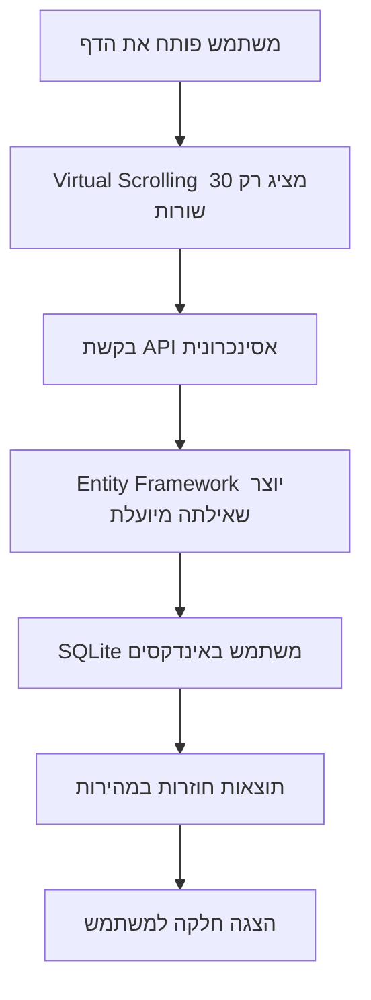

# 📊 מדריך טיפול בכמויות נתונים גדולות
## Student Management System - הסבר מפורט

---

## 🔄 Virtual Scrolling - גלילה וירטואלית

### ❓ מה זה Virtual Scrolling?

Virtual Scrolling היא טכניקה שבה **במקום לרנדר (לצייר) את כל הנתונים**, המערכת מציירת **רק את מה שנראה על המסך** + כמה שורות נוספות למעלה ולמטה.

### 🎯 הבעיה שזה פותר

```plaintext
❌ בלי Virtual Scrolling:
   • 10,000 סטודנטים = 10,000 אלמנטים ב-DOM
   • הדפדפן "נחנק" ונתקע
   • זיכרון מתמלא
   • גלילה איטית ומקוטעת

✅ עם Virtual Scrolling:
   • 10,000 סטודנטים = רק 30 אלמנטים ב-DOM!
   • ביצועים חלקים
   • חסכון עצום בזיכרון
   • חווית משתמש מעולה
```

### 💻 איך זה עובד בקוד?

```javascript
// הקוד שלך ב-StudentListVirtual.vue
const virtualizer = useVirtualizer({
  count: students.value.length,      // 10,000 סטודנטים
  getScrollElement: () => parentRef.value,
  estimateSize: () => 50,           // גובה משוער של כל שורה בפיקסלים
  overscan: 5                       // 5 שורות נוספות מעל ומתחת
})

// התוצאה:
// אם המסך מציג 20 שורות, והמשתמש בשורה 100
// המערכת תרנדר רק שורות 95-125 (30 שורות בסה"כ!)
```

### 📈 היתרונות המרכזיים

| יתרון | הסבר |
|------|------|
| **ביצועים** | הדפדפן לא צריך לנהל אלפי אלמנטים |
| **זיכרון** | שימוש מינימלי בזיכרון - רק מה שנראה |
| **מהירות טעינה** | הדף נטען מיד, לא משנה כמה נתונים |
| **חווית משתמש** | גלילה חלקה ומהירה |

---

## 🗄️ SQLite with Entity Framework Core

### ❓ מה יעיל בשילוב הזה?

#### 1. **SQLite** 
- מסד נתונים קל במיוחד (קובץ בודד)
- מהיר לפרויקטים בינוניים
- לא דורש התקנת שרת נפרד

#### 2. **Entity Framework Core**
- ORM (Object Relational Mapping) מודרני
- כותבים C# נקי במקום SQL גולמי
- אופטימיזציות אוטומטיות

### 💡 דוגמאות ליעילות

```csharp
// ❌ SQL גולמי - מסורבל ומועד לשגיאות
string sql = "SELECT * FROM Students WHERE IsActive = 1 AND AverageGrade > 80";

// ✅ Entity Framework Core - נקי ובטיפוסים
var topActiveStudents = await _context.Students
    .Where(s => s.IsActive && s.AverageGrade > 80)
    .OrderByDescending(s => s.AverageGrade)
    .Take(100)
    .ToListAsync();

// EF Core יוצר SQL מיועל אוטומטית!
```

### 🚀 יתרונות לכמויות גדולות

| תכונה | הסבר | דוגמה |
|--------|------|--------|
| **Lazy Loading** | טוען נתונים רק כשצריך | רק הסטודנטים שמוצגים |
| **Query Optimization** | מייעל שאילתות אוטומטית | בוחר אינדקסים נכונים |
| **Connection Pooling** | שימוש חוזר בחיבורים | חוסך זמן חיבור |
| **Batch Operations** | ביצוע פעולות בקבוצות | עדכון 1000 רשומות בפקודה אחת |

---

## ⚡ Async Operations - פעולות אסינכרוניות

### ❓ מה זה Async/Await?

פעולות אסינכרוניות מאפשרות לשרת **לטפל בבקשות רבות במקביל** במקום לחכות שכל בקשה תסתיים.

### 🔄 השוואה: סינכרוני vs אסינכרוני

#### ❌ קוד סינכרוני (חוסם)
```csharp
public List<Student> GetStudents()
{
    // השרת "תקוע" עד שהשאילתה מסתיימת
    // לא יכול לטפל בבקשות אחרות!
    return _context.Students.ToList(); 
}
```

#### ✅ קוד אסינכרוני (לא חוסם)
```csharp
public async Task<List<Student>> GetStudentsAsync()
{
    // השרת משוחרר לטפל בבקשות אחרות
    // בזמן שמחכה לתוצאות מהמסד
    return await _context.Students.ToListAsync(); 
}
```

### 📊 היתרונות במספרים

```plaintext
תרחיש: 100 משתמשים מבקשים נתונים בו-זמנית
כל שאילתה לוקחת 2 שניות

❌ סינכרוני:
   • זמן כולל: 200 שניות (100 × 2)
   • משתמשים מחכים בתור
   • שרת לא מנצל משאבים

✅ אסינכרוני:
   • זמן כולל: ~2-3 שניות
   • כולם מקבלים תשובה במקביל
   • ניצול מקסימלי של השרת
```

---

## 🔍 Optimized Indexing - אינדקסים מותאמים

### ❓ מה זה אינדקס במסד נתונים?

אינדקס = **"תוכן עניינים" למסד הנתונים**

> **אנלוגיה**: כמו לחפש מילה במילון
> - ❌ בלי אינדקס: קוראים כל עמוד עד שמוצאים
> - ✅ עם אינדקס: הולכים ישר לאות הנכונה

### 🎯 האינדקסים בפרויקט שלך

```csharp
// 1. אינדקס אוטומטי על Primary Key
public int StudentId { get; set; }  // יש אינדקס אוטומטי!

// 2. אינדקס שהוספת על IsActive
modelBuilder.Entity<Student>()
    .HasIndex(s => s.IsActive);
```

### 📈 ההבדל בביצועים

```sql
-- תרחיש: חיפוש סטודנטים פעילים מתוך 100,000 רשומות

-- ❌ בלי אינדקס על IsActive:
SELECT * FROM Students WHERE IsActive = 1
-- זמן: ~500ms (סורק את כל הטבלה)

-- ✅ עם אינדקס על IsActive:
SELECT * FROM Students WHERE IsActive = 1
-- זמן: ~5ms (הולך ישר לרשומות הרלוונטיות)

-- שיפור של פי 100! 🚀
```

### 💡 מתי להוסיף אינדקסים?

| להוסיף אינדקס כאשר | לא להוסיף כאשר |
|-------------------|-----------------|
| שדה מופיע הרבה ב-WHERE | הטבלה קטנה (<1000 רשומות) |
| שדה משמש למיון (ORDER BY) | השדה מתעדכן הרבה |
| שדה משמש לחיבור טבלאות (JOIN) | כבר יש הרבה אינדקסים |

---

## 🎯 סיכום - איך הכל עובד ביחד?

### 🔄 תהליך הטיפול בכמויות גדולות



### 📊 התוצאה הסופית

| מדד | בלי אופטימיזציות | עם אופטימיזציות |
|-----|------------------|------------------|
| **זמן טעינה ראשונית** | 15-30 שניות | < 1 שנייה |
| **זיכרון בדפדפן** | 500MB+ | ~50MB |
| **משתמשים במקביל** | 10-20 | 1000+ |
| **גלילה** | מקוטעת ואיטית | חלקה ומהירה |

### 🚀 המסקנה

השילוב של:
- **Virtual Scrolling** (צד לקוח)
- **Async Operations** (שרת)
- **Entity Framework Core** (ORM)
- **Optimized Indexing** (מסד נתונים)

יוצר מערכת שיכולה לטפל ב**מאות אלפי רשומות** בצורה חלקה ומהירה! 

---

## 📚 המלצות להמשך

### לשיפור נוסף של הביצועים:

1. **Pagination** - חלוקה לעמודים בצד השרת
2. **Caching** - שמירת תוצאות נפוצות בזיכרון
3. **Search Optimization** - חיפוש חכם עם Full-Text Search
4. **Data Compression** - דחיסת נתונים ברשת

### כלים מומלצים:
- **Redis** - למטמון מהיר
- **ElasticSearch** - לחיפושים מורכבים
- **SignalR** - לעדכונים בזמן אמת